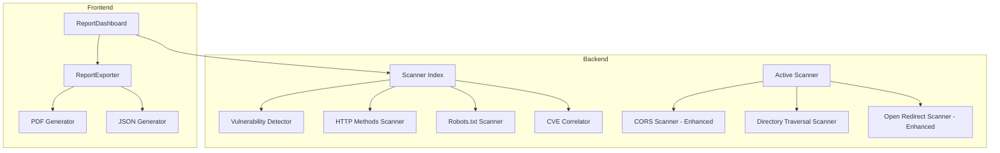

# Design Document: Enhanced Security Scanner

## Overview

Bu tasarım, güvenlik tarama aracına iki ana özellik ekler:
1. **Rapor İndirme**: PDF ve JSON formatlarında güvenlik raporlarının indirilmesi
2. **Gelişmiş Tarama**: Yeni güvenlik açığı tespit modülleri (CORS, Directory Traversal, HTTP Methods, robots.txt analizi, CVE korelasyonu)

Mevcut mimari korunarak, yeni modüller `server/scanners/` dizinine eklenecek ve frontend'de indirme işlevselliği `src/services/` altında implement edilecektir.

## Architecture



## Components and Interfaces

### 1. Report Exporter (Frontend)

```typescript
// src/services/report-exporter.service.ts

interface ReportExportOptions {
  format: 'pdf' | 'json';
  includeExecutiveSummary: boolean;
  includeRemediation: boolean;
  language: 'tr' | 'en';
}

interface ExportResult {
  success: boolean;
  filename: string;
  error?: string;
}

class ReportExporter {
  /**
   * Export security report to specified format
   */
  async export(report: SecurityReport, options: ReportExportOptions): Promise<ExportResult>;
  
  /**
   * Generate filename based on domain and timestamp
   */
  generateFilename(domain: string, format: 'pdf' | 'json'): string;
  
  /**
   * Trigger browser download
   */
  private triggerDownload(blob: Blob, filename: string): void;
}
```

### 2. PDF Generator

```typescript
// src/services/pdf-generator.service.ts

interface PDFSection {
  title: string;
  content: string | Table | Chart;
  pageBreak?: boolean;
}

class PDFGenerator {
  /**
   * Generate PDF from security report
   * Uses jsPDF library for PDF generation
   */
  async generate(report: SecurityReport, lang: 'tr' | 'en'): Promise<Blob>;
  
  /**
   * Add executive summary section
   */
  private addExecutiveSummary(doc: jsPDF, report: SecurityReport): void;
  
  /**
   * Add vulnerability table with severity colors
   */
  private addVulnerabilityTable(doc: jsPDF, vulnerabilities: Vulnerability[]): void;
  
  /**
   * Add action plan section
   */
  private addActionPlan(doc: jsPDF, actionPlan: ActionPlanItem[]): void;
}
```

### 3. HTTP Methods Scanner (Backend)

```typescript
// server/scanners/http-methods-scanner.ts

interface HttpMethodsResult {
  allowedMethods: string[];
  dangerousMethods: string[];
  vulnerabilities: MethodVulnerability[];
}

interface MethodVulnerability {
  method: string;
  severity: 'CRITICAL' | 'HIGH' | 'MEDIUM' | 'LOW';
  description: string;
  risk: string;
}

/**
 * Scan for enabled HTTP methods
 */
async function scanHttpMethods(url: string, lang: 'tr' | 'en'): Promise<HttpMethodsResult>;
```

### 4. Robots.txt & Security.txt Scanner (Backend)

```typescript
// server/scanners/robots-scanner.ts

interface RobotsScanResult {
  robotsTxt: {
    exists: boolean;
    disallowedPaths: string[];
    sensitivePaths: string[];
    sitemapUrls: string[];
  };
  securityTxt: {
    exists: boolean;
    contact?: string;
    encryption?: string;
    policy?: string;
  };
  findings: RobotsFinding[];
}

interface RobotsFinding {
  type: 'sensitive_path' | 'admin_panel' | 'backup_dir' | 'missing_security_txt';
  path?: string;
  severity: 'INFO' | 'LOW' | 'MEDIUM';
  description: string;
}

/**
 * Scan robots.txt and security.txt
 */
async function scanRobots(baseUrl: string, lang: 'tr' | 'en'): Promise<RobotsScanResult>;
```

### 5. CVE Correlator (Backend)

```typescript
// server/scanners/cve-correlator.ts

interface CVEInfo {
  id: string;
  cvssScore: number;
  severity: 'CRITICAL' | 'HIGH' | 'MEDIUM' | 'LOW';
  description: string;
  publishedDate: string;
  nvdUrl: string;
  hasExploit: boolean;
}

interface CVECorrelationResult {
  technology: string;
  version?: string;
  cves: CVEInfo[];
  totalCount: number;
}

/**
 * Correlate detected technologies with known CVEs
 * Uses local CVE database for common technologies
 */
async function correlateCVEs(
  techStack: TechStackItem[],
  lang: 'tr' | 'en'
): Promise<CVECorrelationResult[]>;
```

### 6. Enhanced Active Scanner

Mevcut `active-scanner.ts` dosyası genişletilecek:

```typescript
// server/scanners/active-scanner.ts (enhanced)

interface DirectoryTraversalResult {
  vulnerable: boolean;
  payload: string;
  evidence: string;
  targetFile: string;
}

/**
 * Enhanced directory traversal scanning
 */
async function scanDirectoryTraversal(url: string): Promise<DirectoryTraversalResult[]>;

/**
 * Enhanced CORS scanning with more test cases
 */
async function scanCorsEnhanced(url: string): Promise<CorsResult>;
```

## Data Models

### SecurityReport (Extended)

```typescript
interface SecurityReport {
  // Existing fields...
  targetUrl: string;
  scanTimestamp: string;
  overallScore: number;
  vulnerabilities: Vulnerability[];
  
  // New fields
  httpMethods?: {
    allowed: string[];
    dangerous: string[];
  };
  robotsAnalysis?: {
    sensitivePaths: string[];
    hasSecurityTxt: boolean;
  };
  cveCorrelations?: CVECorrelationResult[];
}
```

### Export Metadata

```typescript
interface ExportMetadata {
  generatedAt: string;
  generatorVersion: string;
  reportFormat: 'pdf' | 'json';
  language: 'tr' | 'en';
  checksum?: string;
}
```

## Correctness Properties

*A property is a characteristic or behavior that should hold true across all valid executions of a system-essentially, a formal statement about what the system should do. Properties serve as the bridge between human-readable specifications and machine-verifiable correctness guarantees.*

### Property 1: JSON Export Round-Trip

*For any* valid SecurityReport object, serializing to JSON and deserializing back should produce an equivalent object with all fields preserved.

**Validates: Requirements 2.1, 2.2**

### Property 2: Filename Generation Format

*For any* domain string and timestamp, the generated filename should match the pattern `security-report-{domain}-{timestamp}.{format}` where format is either 'pdf' or 'json'.

**Validates: Requirements 1.4, 2.3**

### Property 3: JSON Indentation

*For any* SecurityReport, the exported JSON string should contain newline characters and consistent indentation (2 or 4 spaces).

**Validates: Requirements 2.4**

### Property 4: CORS Severity Mapping

*For any* CORS scan result:
- Wildcard origin (*) → HIGH severity
- Reflected origin with credentials → CRITICAL severity  
- Reflected origin without credentials → HIGH severity
- Null origin allowed → MEDIUM severity

**Validates: Requirements 3.2, 3.3, 3.4**

### Property 5: Directory Traversal Detection

*For any* HTTP response containing sensitive file indicators (e.g., "root:x:", "[extensions]", "<?php"), the scanner should report a CRITICAL severity vulnerability with the successful payload included.

**Validates: Requirements 4.2, 4.4**

### Property 6: Open Redirect Detection

*For any* HTTP redirect response (3xx) where the Location header contains an external domain from the test payload, the scanner should report a MEDIUM severity vulnerability with an example exploit URL.

**Validates: Requirements 5.2, 5.4**

### Property 7: HTTP Methods Vulnerability Mapping

*For any* set of enabled HTTP methods:
- PUT enabled → HIGH severity
- DELETE enabled → HIGH severity
- TRACE enabled → MEDIUM severity (XST risk)
- The vulnerability details should include the complete list of enabled methods.

**Validates: Requirements 6.2, 6.3, 6.4**

### Property 8: Robots.txt Analysis

*For any* robots.txt content:
- Disallow entries should be extracted as paths
- Paths matching admin/backup/config patterns should be flagged as sensitive
- Missing security.txt should generate an INFO level finding

**Validates: Requirements 7.2, 7.3, 7.4**

### Property 9: CVE Correlation

*For any* detected technology with version:
- CVE lookup should return results sorted by CVSS score (descending)
- Each CVE should include id, cvssScore, and nvdUrl
- Technologies without version should still return common CVEs for that family

**Validates: Requirements 8.1, 8.2, 8.3, 8.4**

## Error Handling

### Frontend Errors

| Error Type | Handling Strategy |
|------------|-------------------|
| PDF generation failure | Show toast notification, log error, offer JSON as fallback |
| Large report (>10MB) | Warn user, offer to exclude detailed sections |
| Browser download blocked | Show manual download instructions |

### Backend Errors

| Error Type | Handling Strategy |
|------------|-------------------|
| Target unreachable | Skip scanner, continue with others, note in report |
| Timeout (>30s) | Abort scan, return partial results |
| Rate limited | Implement exponential backoff, max 3 retries |
| Invalid response | Log warning, skip to next test |

### Error Response Format

```typescript
interface ScanError {
  scanner: string;
  errorCode: string;
  message: string;
  recoverable: boolean;
  partialResults?: any;
}
```

## Testing Strategy

### Unit Tests

Unit tests will cover:
- Filename generation logic
- Severity mapping functions
- Robots.txt parsing
- CVE data structure validation
- Error handling paths

### Property-Based Tests

Property-based testing will be implemented using **fast-check** library for TypeScript.

Each property test will:
- Run minimum 100 iterations
- Generate random but valid inputs
- Verify the property holds for all generated inputs
- Be tagged with the corresponding design property number

**Test Configuration:**
```typescript
import fc from 'fast-check';

// Minimum 100 iterations per property
const testConfig = { numRuns: 100 };
```

**Test Annotation Format:**
```typescript
// Feature: enhanced-security-scanner, Property 1: JSON Export Round-Trip
// Validates: Requirements 2.1, 2.2
```

### Integration Tests

- End-to-end PDF generation with sample reports
- Full scan pipeline with mock HTTP responses
- Export download flow in browser environment
